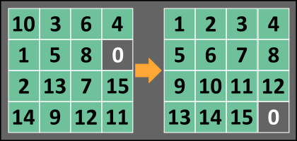

# Sliding Puzzle Solver
A sliding puzzle is a combination puzzle that challenges a player to slide (frequently flat) pieces along certain routes (usually on a board) to establish a certain end-configuration.

Your goal for this kata is to write a function that produces a sequence of tile movements that solves the puzzle.

## Input
An `n x n` array/list comprised of integer values ranging from `0` to `n^2 - 1` (inclusive), which represents a square grid of tiles. Note that there will always be one empty tile (represented by 0) to allow for movement of adjacent tiles.

## Output
An array/list comprised of any (but not necessarily all) of the integers from `1` to `n^2 - 1`, inclusive. This represents the sequence of tile moves for a successful transition from the initial unsolved state to the solved state. If the puzzle is unsolvable, return null(JavaScript, Java, PHP) or None(Python) or the vector {0} (C++).

### Test Example

    let simpleExample = [
    [ 1, 2, 3, 4],
    [ 5, 0, 6, 8],
    [ 9,10, 7,11],
    [13,14,15,12]
    ];
    slidePuzzle(simpleExample); // [6,7,11,12]
    
    // TRANSITION SEQUENCE:
    [ 1, 2, 3, 4]    [ 1, 2, 3, 4]    [ 1, 2, 3, 4]    [ 1, 2, 3, 4]    [ 1, 2, 3, 4]
    [ 5, 0, 6, 8]    [ 5, 6, 0, 8]    [ 5, 6, 7, 8]    [ 5, 6, 7, 8]    [ 5, 6, 7, 8]
    [ 9,10, 7,11] -> [ 9,10, 7,11] -> [ 9,10, 0,11] -> [ 9,10,11, 0] -> [ 9,10,11,12]
    [13,14,15,12]    [13,14,15,12]    [13,14,15,12]    [13,14,15,12]    [13,14,15, 0]
    
    // NOTE: Your solution does not need to follow this exact sequence to pass

### Technical Details
 - Input will always be valid.
 - The range of values for n are: 10 >= n >= 3

# Unfortunately, solution to this kata is still under construction  (!)

The general concept works, but not all test cases can be passed successfully =(  
After a week of trying, I decided that further work on this kata at the moment is an irrational use of time.  
But I will definitely come back to this later and finish what I started.  

